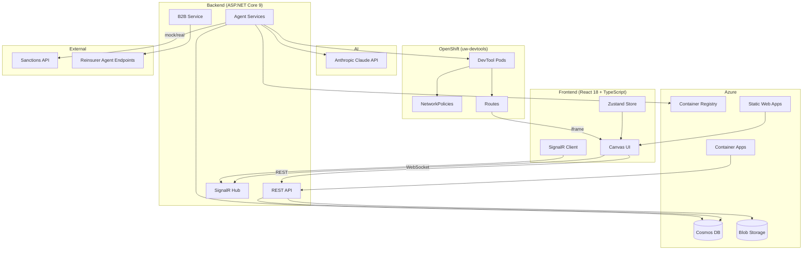
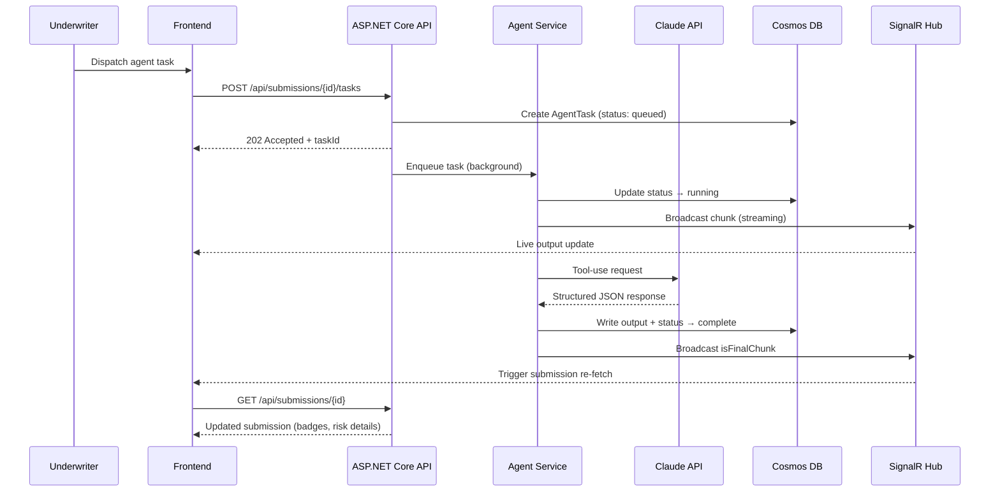
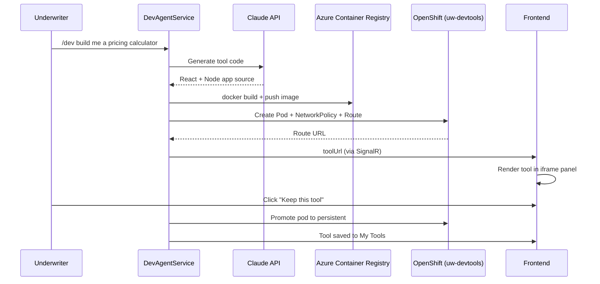

# Underwriter Workbench

A canvas-first AI workbench for specialty insurance underwriters. The underwriter acts as orchestrator, directing a set of specialist AI agents to handle legal review, regulatory compliance, inter-firm communication, and bespoke tooling tasks. Supports both individual submission underwriting and portfolio-level management, with first-class handling of complex risk structures including multi-layer and facultative reinsurance.

---

## Architecture

### System Overview



### Request Flow — Agent Task



### Developer Agent — Tool Lifecycle



### CI/CD Pipeline

```mermaid
flowchart LR
    PR[Pull Request] -->|opens against main| CI

    subgraph CI["CI Jobs (parallel)"]
        BT[Backend Tests\n+ Coverage]
        SS[CodeQL\nSAST Scan]
        DS[Dependency\nVuln Scan]
        E2E[Playwright\nE2E Tests]
    end

    CI -->|all pass + merge to main| Build

    subgraph Build["Build"]
        Docker[Docker Build\n→ ACR Push]
        Trivy[Trivy\nImage Scan]
    end

    Build --> Staging

    subgraph Staging["Staging"]
        DCAS[Deploy API\nContainer Apps]
        DSWAS[Deploy Frontend\nStatic Web Apps]
    end

    Staging -->|manual approval| Prod

    subgraph Prod["Production"]
        DCAP[Deploy API\nContainer Apps]
        DSWAP[Deploy Frontend\nStatic Web Apps]
    end
```



---

## Stack

| Layer | Technology |
|---|---|
| Frontend | React 18 (TypeScript), Vite, TailwindCSS |
| Backend | ASP.NET Core 9, C#, REST + SignalR |
| Database | Azure Cosmos DB (NoSQL) |
| Storage | Azure Blob Storage |
| AI | Anthropic Claude API (`claude-opus-4-6`) |
| Auth | Azure Entra ID (MSAL) |
| Container Registry | Azure Container Registry |
| Hosting — App | Azure Container Apps |
| Hosting — Frontend | Azure Static Web Apps |
| Dev-tool Isolation | OpenShift (`uw-devtools` namespace) |
| Testing | xUnit + Coverlet (backend), Playwright (E2E) |

---

## Agents

| Agent | Purpose |
|---|---|
| **Legal** | Reviews policy wordings, flags non-standard clauses, checks jurisdiction compliance |
| **Names Clearance** | Checks insured, broker, and cedant names against sanctions lists; runs automatically on submission creation and on cedant update |
| **Developer** | Generates, containerises, and deploys bespoke micro-tools (pricing calculators, exposure visualisers) as live OpenShift pods |
| **B2B Comms** | Conducts structured AI-to-AI dialogue with external reinsurer agent endpoints to negotiate FacRi terms |

---

## Project Structure

```text
backend/
├── src/
│   ├── UnderwriterWorkbench.Api/          # Controllers, SignalR hubs, Program.cs
│   ├── UnderwriterWorkbench.Core/         # Models, interfaces (no infrastructure deps)
│   └── UnderwriterWorkbench.Infrastructure/  # Cosmos, agents, OpenShift, blob
└── tests/
    ├── UnderwriterWorkbench.Unit/
    ├── UnderwriterWorkbench.Integration/
    └── UnderwriterWorkbench.Contract/     # Agent mock contract tests

frontend/
├── src/
│   ├── components/canvas/                 # PortfolioView, SubmissionView, tabs
│   ├── components/panels/                 # ContextPanel, AgentPanel, DevToolPanel
│   ├── components/drawers/                # ChatDrawer
│   ├── components/shared/                 # referenceData.ts
│   ├── services/api/                      # workbenchApi.ts
│   ├── services/signalr/                  # workbenchHub.ts
│   └── store/                             # submissionStore, portfolioStore
└── tests/e2e/                             # Playwright specs

infrastructure/
├── docker/                                # Dockerfile.api
└── openshift/                             # devtools-namespace.yaml

.github/
├── workflows/pipeline.yml                 # CI/CD pipeline
└── dependabot.yml                         # Automated dependency PRs
```

---

## Local Development

```bash
# Backend
cd backend
dotnet restore
dotnet run --project src/UnderwriterWorkbench.Api

# Frontend (separate terminal)
cd frontend
npm install
npm run dev

# E2E tests (requires backend running)
cd frontend
npm run test:e2e
```

The frontend dev server runs on `http://localhost:5173` and proxies `/api` and `/hubs` to the backend on `http://localhost:5230`.

Backend tests use the Cosmos DB emulator (`localhost:8081`) and Azurite (`localhost:10000`) — start these before running `dotnet test`.

---

## Infrastructure

All Azure resources are in resource group `rg-uw-workbench` (`uksouth`).

### Provision from scratch

```bash
# 1. Resource group
az group create \
  --name rg-uw-workbench \
  --location uksouth \
  --tags project=underwriter-workbench

# 2. Azure Container Registry
az acr create \
  --name acruwworkbench \
  --resource-group rg-uw-workbench \
  --sku Basic \
  --admin-enabled true \
  --location uksouth

# 3. Log Analytics (required by Container Apps)
az monitor log-analytics workspace create \
  --resource-group rg-uw-workbench \
  --workspace-name law-uw-workbench \
  --location uksouth

# 4. Container Apps Environment
LAW_ID=$(az monitor log-analytics workspace show \
  --resource-group rg-uw-workbench \
  --workspace-name law-uw-workbench \
  --query customerId -o tsv)

LAW_KEY=$(az monitor log-analytics workspace get-shared-keys \
  --resource-group rg-uw-workbench \
  --workspace-name law-uw-workbench \
  --query primarySharedKey -o tsv)

az containerapp env create \
  --name cae-uw-workbench \
  --resource-group rg-uw-workbench \
  --location uksouth \
  --logs-workspace-id "$LAW_ID" \
  --logs-workspace-key "$LAW_KEY"

# 5. Container App — Staging
az containerapp create \
  --name ca-uw-workbench-staging \
  --resource-group rg-uw-workbench \
  --environment cae-uw-workbench \
  --image mcr.microsoft.com/k8se/quickstart:latest \
  --target-port 8080 \
  --ingress external \
  --min-replicas 0 \
  --max-replicas 2 \
  --cpu 0.5 \
  --memory 1.0Gi

# 6. Container App — Production
az containerapp create \
  --name ca-uw-workbench-prod \
  --resource-group rg-uw-workbench \
  --environment cae-uw-workbench \
  --image mcr.microsoft.com/k8se/quickstart:latest \
  --target-port 8080 \
  --ingress external \
  --min-replicas 0 \
  --max-replicas 4 \
  --cpu 1.0 \
  --memory 2.0Gi

# 7. Static Web Apps (westeurope — not available in uksouth)
az staticwebapp create \
  --name swa-uw-workbench-staging \
  --resource-group rg-uw-workbench \
  --location westeurope \
  --sku Free

az staticwebapp create \
  --name swa-uw-workbench-prod \
  --resource-group rg-uw-workbench \
  --location westeurope \
  --sku Free

# 8. Service principal for GitHub Actions
MSYS_NO_PATHCONV=1 az ad sp create-for-rbac \
  --name sp-uw-workbench-github \
  --role Contributor \
  --scopes /subscriptions/<subscription-id>/resourceGroups/rg-uw-workbench \
  --sdk-auth
```

### Retrieve secrets (e.g. after re-provisioning)

```bash
# ACR credentials
az acr credential show --name acruwworkbench --resource-group rg-uw-workbench

# SWA deployment tokens
az staticwebapp secrets list --name swa-uw-workbench-staging --resource-group rg-uw-workbench
az staticwebapp secrets list --name swa-uw-workbench-prod   --resource-group rg-uw-workbench
```

---

## CI/CD Pipeline

Defined in [.github/workflows/pipeline.yml](.github/workflows/pipeline.yml). Triggers on push to `main` and on pull requests targeting `main`.

### Jobs

| Job | Trigger | What it does |
|---|---|---|
| `test-backend` | Every push / PR | Runs all xUnit tests (Unit, Integration, Contract) against a Cosmos emulator + Azurite. Generates Coverlet HTML + Cobertura coverage report, published to the job summary. |
| `security-scan` | Every push / PR | CodeQL SAST analysis for C# and TypeScript/JavaScript. Results surface in the GitHub Security tab. |
| `dependency-scan` | Every push / PR | `dotnet list package --vulnerable` + `npm audit --audit-level=high`. Reports uploaded as artifacts. |
| `test-e2e` | Every push / PR | Starts the backend in `Testing` mode (all external services mocked) alongside a Cosmos emulator + Azurite, then runs the full Playwright suite against the Vite dev server. |
| `build-and-push` | Merge to `main` only | Builds the Docker image, pushes to ACR tagged with the short commit SHA, then runs a Trivy container scan (results go to the Security tab). |
| `deploy-staging` | After `build-and-push` | Deploys the API image to the staging Container App; builds and deploys the frontend to the staging Static Web App. |
| `deploy-production` | After `deploy-staging` | Identical deployment to the production resources. **Gated by a required reviewer approval** configured on the `production` GitHub Environment. |

### Automated dependency updates

Dependabot is configured to open weekly PRs for NuGet packages, npm packages, Docker base images, and GitHub Actions versions.

---

## Deployed Environments

| Environment | API | Frontend |
|---|---|---|
| Staging | `ca-uw-workbench-staging` (Azure Container Apps) | `white-moss-0e3cf9503.4.azurestaticapps.net` |
| Production | `ca-uw-workbench-prod` (Azure Container Apps) | `green-moss-043abc203.2.azurestaticapps.net` |
